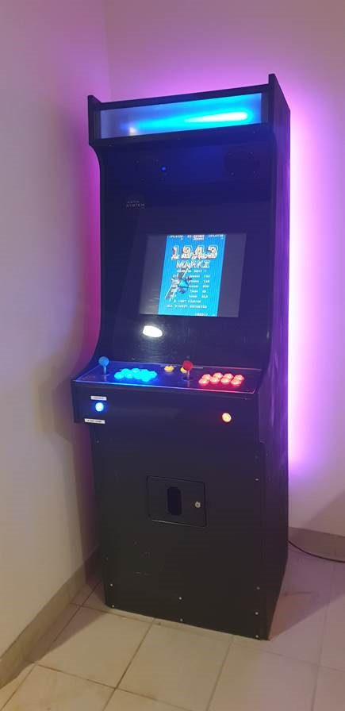

# Arcadium
Dépôt  pour tous les codes concernant la borne d'arcade. Chaque dossier correspond à un périphérique (par exemple l'Arduino qui gère  les LEDs frontales). Le code doit pouvoir être directement compilable une fois le dépot cloné (le nom du .ino doit être le même que son dossier).
Le travail restant est indiqué dans les TODOS


## TODO
- [ ] imprimer et coller les stickers
- [ ] faire un service windows (deamon) ou prendre un soft existant pour  programmer les heures d'activités de la borne




## Emulateur LaunchBox BigBox
[Utilisation de LaunchBox BigBox](https://www.launchbox-app.com/big-box)


## Arduino-Coin-Acceptor
Code pour la carte Arduino gérant le monnayeur. Le monnayeur envoie à l'Arduino via une connection RS232 la valeur de la pièce inséré (nombre arbitraire). La carte Arduino calcule un ratio en fonction du prix de la partie et renvoie un nombre d'impulsions vers le PC gérant l'émulateur.
Plus de détails dans les commentaires du code.

Lien utiles:
- [Interfacing DG600F Coin Acceptor to Arduino](https://bigdanzblog.wordpress.com/2015/01/12/interfacing-dg600f-coin-acceptor-to-arduino/)
- [arduino-coin-acceptor
](https://github.com/hxlnt/arduino-coin-acceptor)
- [DG600F Code examples](https://github.com/vvzen/coin-acceptor)
- [Make Money With Arduino](https://www.instructables.com/id/Make-Money-with-Arduino/)


### TODO
- [ ] faire passer l'Arduino pour un bouton avec un transistor NPN, puis faire une connection entre la Arduino et la carte Reyann Easyget [ça ressemble à ça où intervenir](https://www.amazon.fr/Reyann-LED-Illuminated-DIY-poussoirs/dp/B01G9UOJOC)
- [ ] faire le circuit proprement avec une VeroBoard et les supports

Principe de fonctionnement actuel du bouton monnaie dans la brone:
Pour insérer des crédits, il faut actuellement appuyé sur un bouton. Un appui (impulsion) correspond à un crédit.
- Bouton non appuyé: fil jaune au potentiel 5V (même que rouge)
- Bouton appuyé: fil jaune au potentiel GND (fil noir) -> fermeture du circuit


### Configuration du monnayeur
Chaque pièce est associé à un numéro dans le monnayeur
- C1 : 2€       Valeur monnayeur    40
- C2 : 1€       Valeur monnayeur    20
- C3 : 0,50€    Valeur monnayeur    10
- C4 : 0,20€    Valeur monnayeur    4
- C5 : 0,10€    Valeur monnayeur    2
- C6 : 0,05€    Valeur monnayeur    1

La carte Arduino calcule un ratio avec la valeur suivante
```c
Valeur € = valeur monnayeur * 5
```


## Arduino-Marquee-light
Code pour la carte Arduino gérant les LEDs à adressage  de la face avant.
[Réutilisation d'un code d'exemple de ce dépot](https://github.com/Makuna/NeoPixelBus).
Il faut installer la bibliothéque dans l'IDE Arduino


### TODO
- [ ] Tester le code NeoPixelCyclon pour savoir s'il s'agit du bon (tester sur d'autres LEDs à adressage !!!)
- [ ] Si ce n'est pas le bon, refaire le même à partie de l'exemple de la bibliothéque 

## Arduino-rear-LED
Code pour la carte Arduino Nano gérant les LEDs arrières. Ce programme contient :

- un PWM logiciel pour avoir 3 sorties PWM simultanées sur une carte Nano (contourner la limitation matérielle)
- une gestion des LEDs en mode RGB
- une correction du gamma (TODO fonction pouvant être supprimé)

### TODO
- [ ] retrouver la version du code qui fait scintiller les leds (fadding effect)
- [ ] supprimer la correction gamma